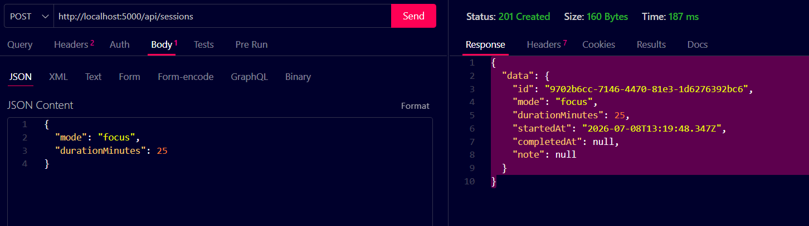
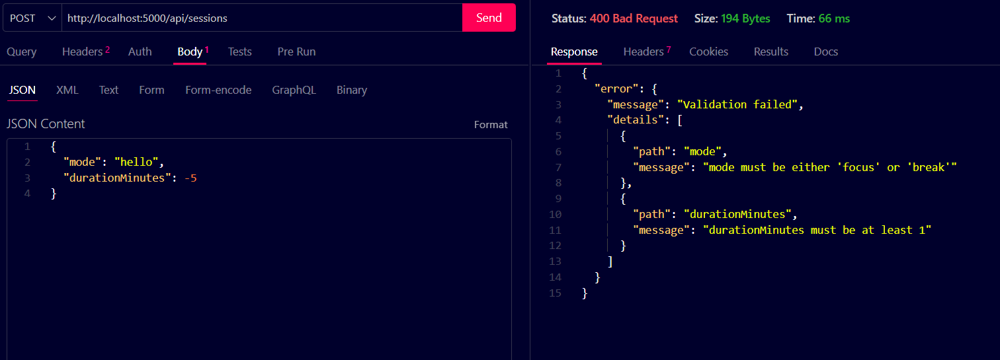
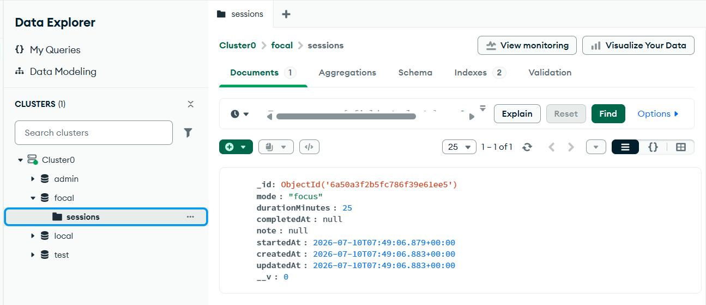
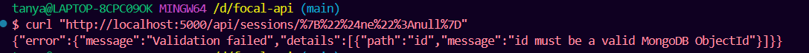

# 🧠 Focal API — Backend Session Tracker with MongoDB Persistence

**A RESTful backend API for tracking focus and break sessions, built with Node.js, Express, TypeScript, and MongoDB.**

> **Project 2 — Backend API Development**  
> **Project 3 — Database Integration**  
> DecodeLabs Full Stack Internship (Batch 2026)


---

# 📖 Overview

Focal API is the backend service for the **Focal Focus Timer** application, built across two connected DecodeLabs milestones in this same repository:

- **Project 2 (Backend API Development):** a layered Express + TypeScript API with full CRUD, Zod request validation, and centralized error handling, originally backed by an in-memory store
- **Project 3 (Database Integration):** the in-memory store replaced with **MongoDB Atlas** via Mongoose, adding schema-level validation, indexing, and NoSQL-injection-safe queries — with no changes needed to the controller or service layers, since the layered architecture from Project 2 kept storage isolated from business logic

**This repo link is submitted for both milestones.** Everything below reflects the current, complete state of the project — proof screenshots for both projects are included in the Screenshots section.

---

# 🌐 Live API

**Base URL**

https://focal-api.onrender.com

**Health Check**

https://focal-api.onrender.com/health

> **Note:** The API is hosted on Render's free tier, so the first request may take 30–60 seconds to wake up the server. Data now persists in MongoDB Atlas, so sessions survive server restarts and cold starts.

---

# ✨ Features

**From Project 2 — Backend API Development:**
- 🚀 Full CRUD operations for focus sessions
- 🛡️ Request validation using **Zod**
- 📦 Layered architecture (Routes → Controllers → Services → Repository)
- ⚠️ Centralized error handling
- 📝 Request logging middleware
- ❤️ Health check endpoint
- 🔧 Environment-based configuration
- 💯 Type-safe code with TypeScript

**Added in Project 3 — Database Integration:**
- 🗄️ **MongoDB Atlas + Mongoose** — schema-level validation (`required`, `enum`, `min`/`max`, `maxlength`) enforced at the database layer
- 🛡️ **Two-layer validation** — Zod validates request shape, Mongoose validates document shape before persistence
- 🚫 **NoSQL-injection safe** — route params validated against a strict ObjectId pattern before ever reaching a query
- 📇 Indexed `mode` field for efficient filtering as the collection grows
- 💾 Data now survives server restarts and Render cold starts

---

# 🛠️ Tech Stack

| Category | Technology |
|-----------|------------|
| Runtime | Node.js |
| Framework | Express.js |
| Language | TypeScript |
| Database | MongoDB Atlas |
| ODM | Mongoose |
| Validation | Zod (request) + Mongoose schema (persistence) |
| Tooling | ts-node-dev, ESLint, Prettier |

---

# 📂 Project Structure

```text
focal-api/
├── src/
│   ├── config/          # env config + MongoDB connection
│   ├── controllers/
│   ├── middleware/
│   ├── models/          # Mongoose schema
│   ├── repositories/    # MongoDB data access
│   ├── routes/
│   ├── schemas/
│   ├── services/
│   ├── utils/
│   ├── app.ts
│   └── index.ts
├── screenshots/
├── .env.example
├── tsconfig.json
└── README.md
```

---

# ⚙️ Environment Variables

Create a `.env` file:

```env
PORT=5000
NODE_ENV=development
MONGODB_URI=mongodb+srv://<user>:<password>@<cluster>.mongodb.net/focal
```

---

# 🚀 Getting Started

```bash
git clone https://github.com/TanyaVaish-17/focal-api.git

cd focal-api

npm install

cp .env.example .env

# edit .env with your own MongoDB Atlas connection string

npm run dev
```

Server runs locally at:

```text
http://localhost:5000
```

On startup you should see `MongoDB connected` before `Focal API running on...`.

---

# 📡 API Endpoints

| Method | Endpoint | Description |
|---------|----------|-------------|
| GET | `/health` | Health check |
| GET | `/api/sessions` | Get all sessions |
| GET | `/api/sessions/:id` | Get a session |
| POST | `/api/sessions` | Create a session |
| PUT | `/api/sessions/:id` | Update a session |
| DELETE | `/api/sessions/:id` | Delete a session |

---

# 📝 Example Request

```bash
curl -X POST http://localhost:5000/api/sessions \
-H "Content-Type: application/json" \
-d '{"mode":"focus","durationMinutes":25}'
```

---

# 📸 Screenshots

### ✅ Create Session — Project 2

Successful `POST /api/sessions` request returning **201 Created**.

<p align="center">
  
</p>

---

### ❌ Validation Error — Project 2

Invalid request returning **400 Bad Request** with validation details.

<p align="center">
  
</p>

---

### 🗄️ Session Persisted in MongoDB Atlas — Project 3

Data Explorer showing the `sessions` collection with real documents, proving persistence beyond the server process.

<p align="center">
  
</p>

---

### 🚫 Injection Rejected — Project 3

A malformed/malicious `:id` returning **400 Bad Request** instead of reaching the database.

<p align="center">
  
</p>

---

# 🔮 Future Improvements

- 🔐 Add JWT Authentication (Project 4 territory)
- 📄 Pagination & date-range filtering on `GET /api/sessions`
- 🧪 Unit & Integration Tests
- 📇 Compound index on `mode` + `startedAt` once query patterns are clearer

---

# 👩‍💻 Author

**Tanya Vaish**

Full Stack Development Intern  
DecodeLabs (Batch 2026)

---

⭐ If you found this project helpful, consider giving it a star!